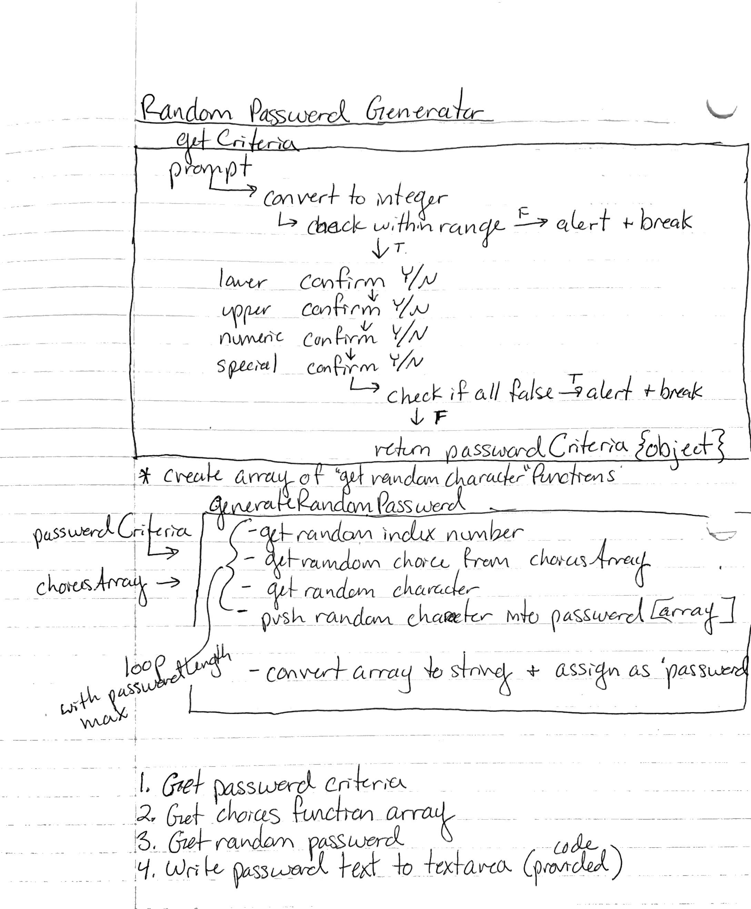
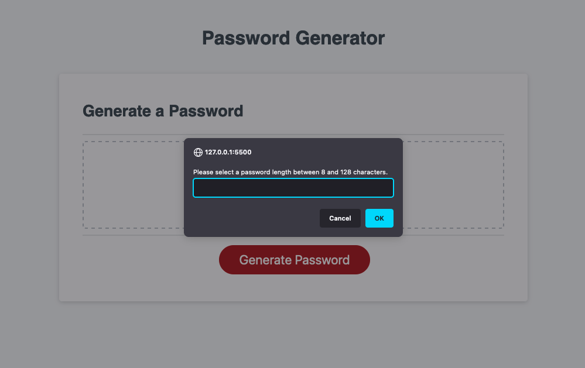
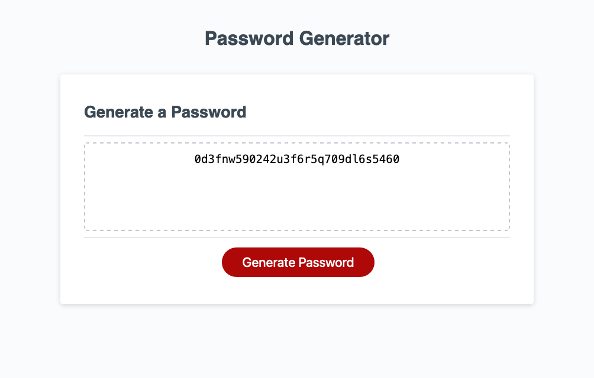

# Employee Random Password Generator

A random password generator using HTML, CSS, and JS.

The generator prompts users for specific criteria including a password length of 8-128 characters, and at least one character type (lowercase, uppercase, numeric, special). This criteria is then used to generate the password after all on-screen prompts.

## Deployed Application

[Employee random password generator](https://kayleriegerpatton.github.io/employee-random-password-generator/ "Employee random password generator")

## User Story

GIVEN the user is an employee who needs to create a random password based on accepted criteria  
WHEN the employee clicks "Generate Password"  
THEN they are prompted to enter a password length in a given range

WHEN the user enters a valid number  
THEN they are prompted to choose what type of characters to use in their password

WHEN the user doesn't choose any of the character types  
THEN they are prompted to choose at least one character type

WHEN the user selects at least one character type and completes the prompts  
THEN they are presented with a randomly generated password of their chosen length and comprised of their selected character type(s)

## Built With

- CSS
- HTML
- Javascript

## Work Flow & Planning

Flow chart and notes:

- The application first gets password criteria by prompting the user for a length, validating the response, and then confirming the desired character type(s), requiring at least one selection. These 5 criteria are all assigned to a password criteria object.
- Four functions for getting random characters (lowercase, uppercase, numeric, and special) are pushed into a choices array.
- The password criteria object and choices array are then passed as arguments in the main generateRandomPassword function which loops through the choices array based on the user's selections, pushing randomly selected characters into the password array.
- The completed password array values are then joined as a string, declared as the password variable, and written to the document's textarea.

## Screenshots

Generator prompt message:

Password generator result display:

